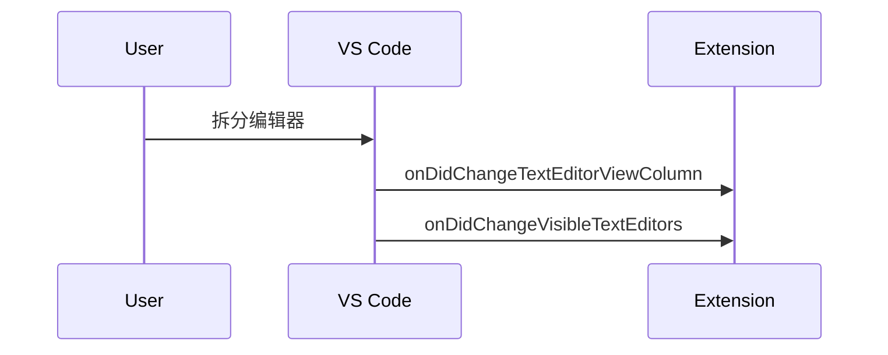
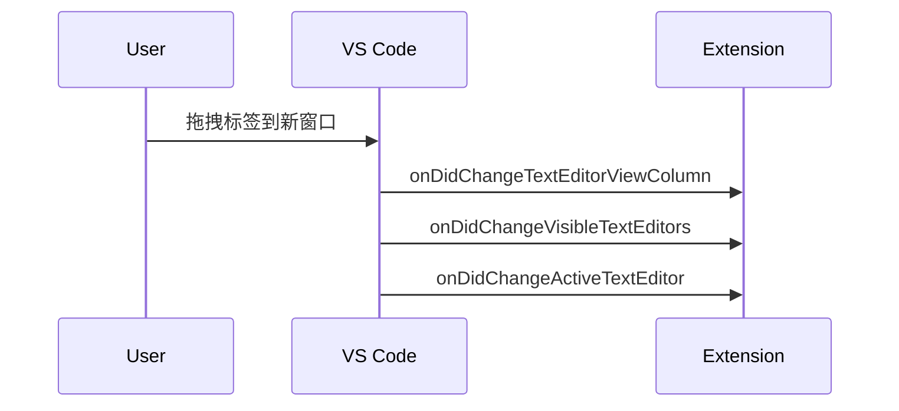

| 事件                            | 触发时机         | 能否阻止渲染 |
| :------------------------------ | :--------------- | :----------- |
| `onDidOpenTextDocument`         | 文件加载到内存后 | ❌ 不能       |
| `onWillSaveTextDocument`        | 文件保存前       | ✅ 可延迟保存 |
| `onDidChangeVisibleTextEditors` | 编辑器标签切换时 | ❌ 不能       |

| 事件类型     | 关键事件                          | 触发时机     | 编辑器状态 |
| :----------- | :-------------------------------- | :----------- | :--------- |
| **文件打开** | `onWillOpenTextDocument`          | 内容加载前   | 未创建     |
|              | `onDidOpenTextDocument`           | 内容加载后   | **未创建** |
|              | `onDidChangeVisibleTextEditors`   | 编辑器创建后 | 已创建     |
|              | `onDidChangeActiveTextEditor`     | 编辑器激活后 | 已激活     |
| **文件关闭** | `onWillSaveTextDocument`          | 保存前       | 存在       |
|              | `onDidSaveTextDocument`           | 保存后       | 存在       |
|              | `onDidChangeActiveTextEditor`     | 焦点转移     | 存在       |
|              | `onDidChangeVisibleTextEditors`   | 编辑器隐藏   | 存在       |
|              | `onDidCloseTextDocument`          | 内存卸载     | 已销毁     |
| **标签切换** | `onDidChangeActiveTextEditor`     | 焦点变化     | 存在       |
|              | `onDidChangeTextEditorViewColumn` | 面板移动     | 存在       |


| 时序 | 文件打开                      |                    |          |
| ---- | ----------------------------- | ------------------ | -------- |
|      | 事件                          | vscode工作         | 可能性   |
| 1    | onWillOpenTextDocument        | 文件打开请求已接收 | 取消打开 |
| 2    |                               | 文件加载           |          |
| 3    | onDidOpenTextDocument         | TextDocument可用   |          |
| 4    |                               | 编辑器创建         |          |
| 5    | onDidChangeVisibleTextEditors | editor可用         |          |
| 6    |                               | 激活编辑器(焦点)   |          |
| 7    | onDidChangeActiveTextEditor   |                    |          |
|      |                               |                    |          |

#### 打开命令是可以拦截的

* 在willopen事件中拦截(建议)

```js
vscode.workspace.onWillOpenTextDocument(event => {
    if (shouldBlock(event.document)) {
        // 取消打开
        event.waitUntil(Promise.reject("Blocked by extension"));
      	// 一个拒绝的promise就可以了
        vscode.window.showErrorMessage("文件被阻止打开");
    }
});
```

* 拦截vscode默认打开行为(不建议)

```typescript
vscode.commands.registerCommand('vscode.open', (uri) => {
    if (uri.path.endsWith('.lock')) {
        vscode.window.showErrorMessage('禁止打开锁文件！');
        return; // 阻断默认打开行为
    }
    return vscode.commands.executeCommand('_originalOpen', uri); // 调用原始命令
});
```

需在`package.json`中声明覆盖默认打开命令:

```json
"contributes": {
    "commands": [{
        "command": "vscode.open",
        "title": "Open File (Custom)"
    }]
}
```


**文件关闭**：

## 关闭未保存的激活文件

| 时序 | 事件                            | VS Code 工作流程     | 插件干预可能性    | 触发条件说明                     | 可选 |
| :--- | :------------------------------ | :------------------- | :---------------- | :------------------------------- | ---- |
| 1    | `onDidChangeActiveTextEditor`   | 焦点转移到其他编辑器 |                   | 仅当关闭的是当前激活编辑器时触发 | 是   |
| 2    | `onDidChangeVisibleTextEditors` | 编辑器从可见集合移除 |                   | 编辑器标签关闭时触发             | 否   |
| 3    | `onWillSaveTextDocument` (可选) | 如有未保存更改       | ✅ 可延迟/取消保存 | 仅在文件有未保存更改时触发       | 是   |
|      |                                 | 文件保存到磁盘       |                   |                                  |      |
|      | `onDidSaveTextDocument` (可选)  | 保存完成             |                   | 仅在文件有未保存更改时触发       | 是   |
|      |                                 | 编辑器视图销毁       |                   |                                  |      |
|      | `onDidCloseTextDocument`        | 文档从内存卸载       |                   | 所有编辑器关闭后触发             | 否   |

### 关

| 时序 | 事件                            | VS Code 工作流程     | 插件干预可能性    |
| :--- | :------------------------------ | :------------------- | :---------------- |
| 1    | `onDidChangeActiveTextEditor`   | 焦点转移到其他编辑器 | ❌ 无法阻止转移    |
| 2    | `onDidChangeVisibleTextEditors` | 编辑器从可见集合移除 | ❌ 无法阻止隐藏    |
| 3    | `onWillSaveTextDocument` (可选) | 如有未保存更改       | ✅ 可延迟/取消保存 |
| 4    | `onDidSaveTextDocument` (可选)  | 保存完成             |                   |
| 5    | `onDidCloseTextDocument`        | 文档从内存卸载       |                   |


|      | 文件关闭                        |                          |                   |
| :--- | :------------------------------ | :----------------------- | :---------------- |
| 时序 | 事件                            | VS Code 工作流程         | 插件干预可能性    |
| 1    | `onWillSaveTextDocument`        | 保存前（如有未保存更改） | ✅ 可延迟/取消保存 |
| 2    |                                 | 文件保存到磁盘           |                   |
| 3    | `onDidSaveTextDocument`         | 文件保存完成             |                   |
| 4    | `onDidChangeActiveTextEditor`   | 激活编辑器转移到其他文件 | ❌ 无法阻止转移    |
| 5    | `onDidChangeVisibleTextEditors` | 编辑器不再可见           | ❌ 无法阻止隐藏    |
| 6    |                                 | 编辑器视图销毁           |                   |
| 7    | `onDidCloseTextDocument`        | TextDocument 从内存卸载  |                   |

- **`onDidCloseTextDocument` 触发条件**:当文件的所有编辑器标签都关闭时
- **自动保存**:会触发 `onWillSaveTextDocument` 和 `onDidSaveTextDocument`

**标签切换事件补充**：

| 时序 | 事件                              | 触发场景               | 插件干预可能性      |
| :--- | :-------------------------------- | :--------------------- | :------------------ |
| 1    | `onDidChangeActiveTextEditor`     | 切换到不同编辑器标签   | ❌ 无法阻止切换      |
| 2    | `onDidChangeTextEditorSelection`  | 光标位置或选择区域变化 | ❌ 无法阻止选择      |
| 3    | `onDidChangeTextEditorViewColumn` | 编辑器移动到不同面板   | ❌ 无法阻止移动      |
| 4    | `onDidChangeVisibleTextEditors`   | 编辑器集合变化         | ❌ 无法阻止显示/隐藏 |


|      | tab切换                              |                        |                     |
| :--- | :----------------------------------- | :--------------------- | :------------------ |
| 时序 | 事件                                 | VS Code 工作流程       | 插件干预可能性      |
| 1    | `onDidChangeActiveTextEditor`        | 激活编辑器变化         | ❌ 无法阻止切换      |
| 2    | `onDidChangeTextEditorSelection`     | 选择区域变化           | ❌ 无法阻止选择      |
| 3    | `onDidChangeTextEditorVisibleRanges` | 可见区域变化           | ❌ 无法阻止滚动      |
| 4    | `onDidChangeTextEditorViewColumn`    | 编辑器在不同面板间移动 | ❌ 无法阻止移动      |
| 5    | `onDidChangeVisibleTextEditors`      | 可见编辑器集合变化     | ❌ 无法阻止显示/隐藏 |





### 自动保存会触发 onWillSaveTextDocument 

- `onWillSaveTextDocument`（保存前）
- `onDidSaveTextDocument`（保存后）

与手动保存的唯一区别是 `event.reason` 的值：

```ts
vscode.workspace.onWillSaveTextDocument(event => {
    if (event.reason === vscode.TextDocumentSaveReason.AfterDelay) {
        console.log("自动保存触发");
    } else if (event.reason === vscode.TextDocumentSaveReason.Manual) {
        console.log("手动保存触发");
    }
});
```

